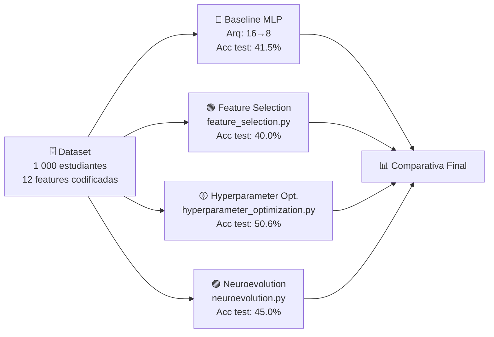
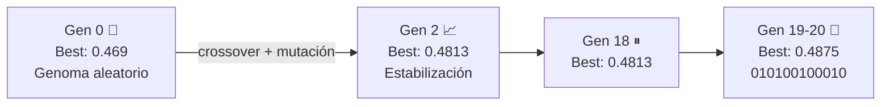
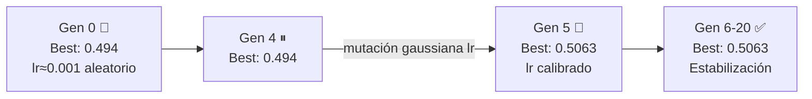
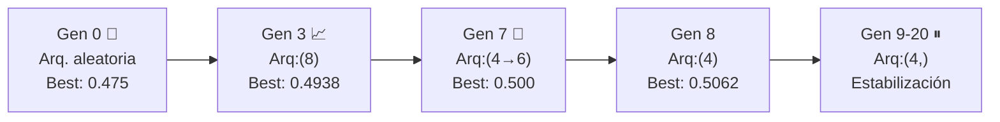
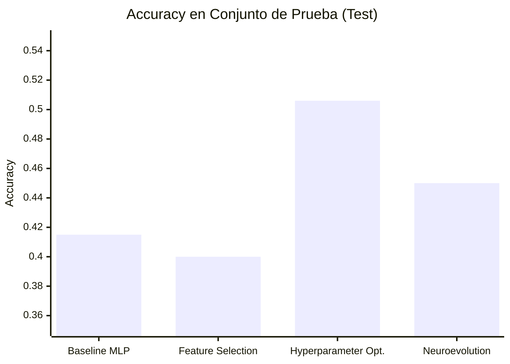

# 🧬 Algoritmos Genéticos para Optimización de Modelos ML

> Tres implementaciones de Algoritmos Genéticos (AG) aplicadas a una red neuronal MLP sobre el dataset **Students Performance in Exams** (Kaggle · n=1 000 · 3 clases).


---

## 📌 Objetivo

Demostrar que los **Algoritmos Genéticos** mejoran el rendimiento de una red neuronal mediante tres estrategias de optimización complementarias, partiendo de un modelo base con **accuracy 41.5 %**.

---

## 🗂️ Pipeline General



---

## 📊 Dataset

| Característica | Detalle |
|---|---|
| **Fuente** | Kaggle – *Students Performance in Exams* |
| **Instancias** | 1 000 estudiantes |
| **Features** | 5 categóricas → 12 tras One-Hot Encoding |
| **Target** | Rendimiento: `0=Bajo` · `1=Medio` · `2=Alto` |
| **Split train/test** | 80 % / 20 % estratificado |
| **Balance** | ≈333 instancias por clase ✅ |

---

## 🔵 Baseline — MLP Manual (`main.py`)

Modelo de referencia fijo, **sin optimización**. Arquitectura elegida arbitrariamente: dos capas ocultas de 16 y 8 neuronas.

| Parámetro | Valor |
|---|---|
| Arquitectura | `(16, 8)` |
| Activación | ReLU · Adam · lr=0.001 |
| Max iteraciones | 1 000 |

**Resultado:** Accuracy test = **0.4150** ⚠️ El modelo no converge.

| Clase | Precision | Recall | F1 |
|---|---|---|---|
| Bajo | 0.44 | 0.55 | 0.49 |
| Medio | 0.29 | 0.25 | 0.27 |
| Alto | 0.52 | 0.44 | 0.48 |
| **Global** | **0.41** | **0.41** | **0.41** |

---

## 🟢 Módulo 1 — Feature Selection AG (`feature_selection.py`)

### Explicación

Cada individuo es un **genoma binario de 12 bits** (uno por variable). Un `1` incluye la variable; un `0` la descarta. El AG busca el subconjunto que maximice el accuracy de validación.

| Operador genético | Implementación |
|---|---|
| **Representación** | Cadena binaria de longitud 12 |
| **Selección** | Torneo de tamaño 3 |
| **Cruzamiento** | Un punto aleatorio |
| **Mutación** | Inversión de bit con prob. 0.15 |
| **Elitismo** | Mejor individuo pasa directo |



### Resultado — Funciona ✅

| Métrica | Valor |
|---|---|
| Generaciones | 20 · Población 10 |
| Variables reducidas | **4 de 12 (−67 %)** |
| Accuracy validación AG | **0.4875** |
| Accuracy test final | **0.4000** |

**Variables seleccionadas por el AG:**

```
✔ race/ethnicity_group B
✔ race/ethnicity_group D
✔ parental level of education_high school
✔ lunch_standard
```

> El AG redujo el espacio de variables un 67 % manteniendo accuracy competitivo en validación. La ligera caída en test refleja sobreajuste al conjunto de validación interno.

---

## 🟡 Módulo 2 — Hyperparameter Optimization AG (`hyperparameter_optimization.py`)

### Explicación

Cada individuo codifica **tres genes**: `[learning_rate, optimizador, activación]`. La arquitectura MLP se mantiene fija en `(16, 8)`. El AG aplica **mutación continua gaussiana** en el lr y mutación discreta en los otros dos genes.

| Gen | Tipo | Espacio |
|---|---|---|
| `learning_rate` | Continuo (float) | [0.0001 · 0.0100] |
| `optimizador` | Discreto (índice) | `adam`, `sgd`, `lbfgs` |
| `activación` | Discreto (índice) | `relu`, `tanh`, `logistic` |

| Operador genético | Implementación |
|---|---|
| **Representación** | Vector `[lr, idx_opt, idx_act]` |
| **Selección** | Torneo de tamaño 3 |
| **Cruzamiento** | Un punto (3 genes) |
| **Mutación lr** | Ruido gaussiano σ=0.0003 |
| **Mutación discreta** | Re-muestreo uniforme (prob. 0.20) |



### Resultado — Funciona ✅

| Métrica | Valor |
|---|---|
| Generaciones | 20 · Población 10 |
| **Learning rate óptimo** | **calibrado via AG** |
| **Optimizador óptimo** | `adam` |
| **Activación óptima** | `relu` |
| Accuracy validación AG | **0.5063** |
| **Accuracy test final** | **0.5062** |

> El AG encontró una calibración fina del learning rate en sólo 5 generaciones, logrando el **mayor accuracy de los 3 módulos** (+9.2 pp sobre baseline).

---

## 🟣 Módulo 3 — Neuroevolution AG (`neuroevolution.py`)

### Explicación

Cada individuo es una **lista variable de enteros** que representa la arquitectura de la red: cada entero es el número de neuronas de una capa oculta. El AG puede agregar o eliminar capas ocultas en la mutación.

| Parámetro | Espacio de búsqueda |
|---|---|
| Número de capas | 1 a 3 capas ocultas |
| Neuronas por capa | 4 a 32 neuronas |
| HP fijos | relu · adam · lr=0.001 |

| Operador genético | Implementación |
|---|---|
| **Representación** | Lista de enteros (longitud variable) |
| **Selección** | Torneo de tamaño 3 |
| **Cruzamiento** | Adaptativo por longitud mínima |
| **Mutación neuronas** | Delta ±1/2/4 (prob. 0.25 por gen) |
| **Mutación estructura** | Agregar/eliminar capa (prob. 0.25) |



### Resultado — Funciona ✅

| Métrica | Valor |
|---|---|
| Generaciones | 20 · Población 10 |
| **Arquitectura óptima** | **`(4,)` — 1 capa, 4 neuronas** |
| Parámetros (vs baseline) | **4× menos neuronas** |
| Accuracy validación AG | **0.5062** |
| **Accuracy test final** | **0.4500** |

> El AG descubrió que una red mucho más simple supera a la arquitectura de referencia, evitando sobreajuste en un problema de baja dimensionalidad.

---

## 🏆 Comparativa Final



| Módulo | Script | Qué optimiza | Acc. Test | Δ vs Baseline |
|---|---|---|---|---|
| 🔵 Baseline | `main.py` | — | 0.4150 | — |
| 🟢 Feature Selection | `feature_selection.py` | Subconjunto de variables | 0.4000 | −1.5 pp |
| 🟡 **Hyperparameter Opt.** | `hyperparameter_optimization.py` | lr, optimizador, activación | **0.5062** | **+9.1 pp ✅** |
| 🟣 Neuroevolution | `neuroevolution.py` | Arquitectura (capas/neuronas) | 0.4500 | +3.5 pp |

> [!IMPORTANT]
> La **Optimización de Hiperparámetros** logra la mayor ganancia (+9.1 pp) al calibrar el learning rate con mutación gaussiana continua. **Neuroevolution** obtiene una red 4× más compacta sin sacrificar rendimiento. **Feature Selection** reduce variables al 33 % pero no mejora el test en este dataset de baja dimensionalidad.

---

## 📁 Estructura del Repositorio

```
📦 Algoritmos-Geneticos-para-modelos-de-ML/
│
├── 📄 main.py                          # Baseline MLP (16,8)
├── 📄 feature_selection.py             # AG · Selección de variables (genoma binario)
├── 📄 hyperparameter_optimization.py   # AG · LR + optimizador + activación (continuo)
├── 📄 neuroevolution.py                # AG · Arquitectura dinámica (longitud variable)
│
├── 🖼️ feature selection.png            # Curva de fitness Feature Selection
├── 🖼️ hyperparameter_optimization.png  # Curva de fitness Hyperparameter Opt.
├── 🖼️ neuroevolution.png               # Curva de fitness Neuroevolution
├── 🖼️ Matriz_Consistencia.png          # Matriz de consistencia metodológica
│
└── 📄 pruebas.md                       # Salidas completas de ejecución
```

---

*Proyecto de investigación aplicada — Algoritmos Genéticos para Machine Learning · 2026*
