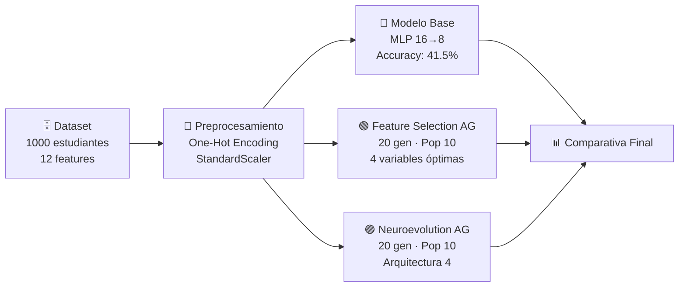
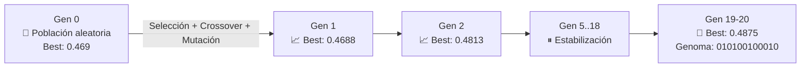
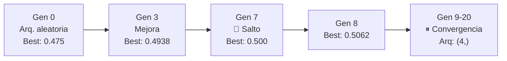
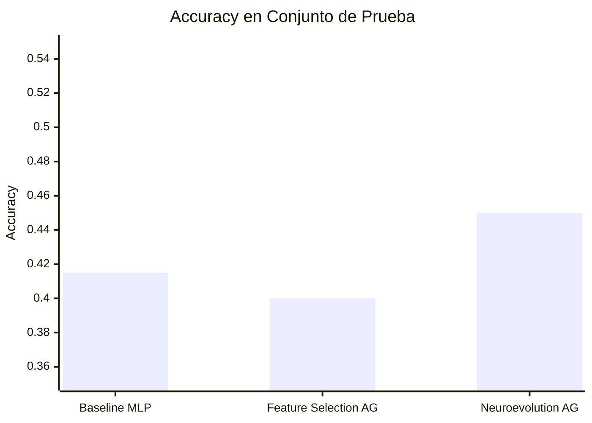

# 🧬 Algoritmos Genéticos para Optimización de Modelos ML

> Aplicación de algoritmos evolutivos para optimizar redes neuronales sobre el dataset *Students Performance in Exams* (Kaggle, n=1000).

---

## 📌 Objetivo

Demostrar que los **Algoritmos Genéticos (AG)** superan a la configuración manual de hiperparámetros al:
1. **Seleccionar variables** relevantes (Feature Selection)
2. **Optimizar la arquitectura** de una red neuronal (Neuroevolution)

---

## 🗂️ Pipeline del Proyecto



---

## 📊 Dataset

| Característica | Detalle |
|---|---|
| **Fuente** | Kaggle – Students Performance in Exams |
| **Instancias** | 1,000 estudiantes |
| **Features originales** | 12 (tras One-Hot Encoding) |
| **Target** | Nivel de rendimiento: Bajo / Medio / Alto |
| **Split** | 80% entrenamiento · 20% prueba |
| **Balance** | ~333 instancias por clase ✅ |

---

## 🔵 Baseline — MLP Manual

Configuración de referencia entrenada sin optimización.

| Parámetro | Valor |
|---|---|
| Arquitectura | `(16, 8)` — 2 capas ocultas |
| Activación | ReLU |
| Optimizador | Adam · lr=0.001 |
| Max iteraciones | 1,000 |

### Reporte de Clasificación

| Clase | Precision | Recall | F1-Score |
|---|---|---|---|
| Bajo | 0.44 | 0.55 | 0.49 |
| Medio | 0.29 | 0.25 | 0.27 |
| Alto | 0.52 | 0.44 | 0.48 |
| **Global** | **0.41** | **0.41** | **0.41** |

> [!NOTE]
> El modelo base no converge (ConvergenceWarning), indicando que la arquitectura y/o las variables no son óptimas.

---

## 🟢 Módulo 1 — Feature Selection con AG

Búsqueda binaria sobre el espacio de 12 variables para maximizar accuracy de validación.



### Resultado

| Métrica | Valor |
|---|---|
| Generaciones | 20 |
| Tamaño de población | 10 |
| **Variables seleccionadas** | **4 de 12** |
| **Mejor accuracy (validación)** | **0.4875** |

**Variables óptimas encontradas:**
- `race/ethnicity_group B`
- `race/ethnicity_group D`
- `parental level of education_high school`
- `lunch_standard`

---

## 🟣 Módulo 2 — Neuroevolution con AG

Búsqueda evolutiva sobre el espacio de arquitecturas neuronales (1–3 capas, 4–32 neuronas por capa).



### Resultado

| Métrica | Valor |
|---|---|
| Generaciones | 20 |
| Tamaño de población | 10 |
| Rango de capas | 1 a 3 |
| Rango de neuronas | 4 a 32 |
| **Arquitectura óptima** | **`(4,)` — 1 capa oculta** |
| **Mejor accuracy (validación)** | **0.5062** |

---

## 🏆 Comparativa Final



| Modelo | Arquitectura | Variables | Accuracy Test |
|---|---|---|---|
| 🔵 Baseline | `(16, 8)` | 12 | 0.4150 |
| 🟢 Feature Selection AG | `(16, 8)` | 4 | 0.4000 |
| 🟣 **Neuroevolution AG** | **`(4,)`** | **12** | **0.4500 ✅** |

> [!IMPORTANT]
> **Neuroevolution** logra el mayor accuracy en test (+3.5 pp sobre baseline) con una arquitectura **4× más simple** que el modelo de referencia.

---

## 📁 Estructura del Repositorio

```
📦 Algoritmos-Geneticos-para-modelos-de-ML/
├── 📄 main.py                         # Modelo baseline MLP
├── 📄 feature_selection.py            # AG para selección de variables
├── 📄 hyperparameter_optimization.py  # AG para neuroevolution
├── 🖼️ feature selection.png           # Curva de fitness - Feature Selection
├── 🖼️ neuroevolution.png              # Curva de fitness - Neuroevolution
└── 🖼️ Matriz_Consistencia.png         # Matriz de consistencia metodológica
```

---

## 🛠️ Stack Tecnológico


---

*Algoritmos Genéticos · Machine Learning · 2026*
